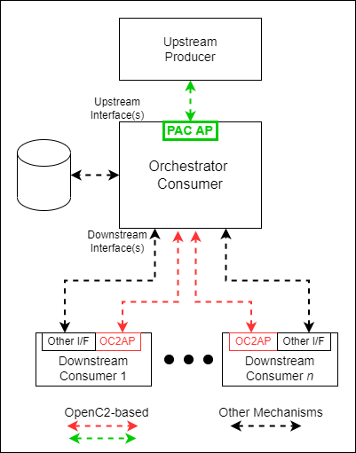

-------

# OpenC2 Actuator Profile for Posture Attribute Collection Version 1.0

## Working Draft 01

## 18 May 2022

&nbsp;

<!-- URI list start (commented out except during publication by OASIS TC Admin)

#### This stage:
https://docs.oasis-open.org/openc2/ap-pac/v1.0/csd01/ap-pac-v1.0-csd01.md (Authoritative) \
https://docs.oasis-open.org/openc2/ap-pac/v1.0/csd01/ap-pac-v1.0-csd01.html \
https://docs.oasis-open.org/openc2/ap-pac/v1.0/csd01/ap-pac-v1.0-csd01.pdf

#### Previous stage:
N/A

#### Latest stage:
https://docs.oasis-open.org/openc2/ap-pac/v1.0/ap-pac-v1.0.md (Authoritative) \
https://docs.oasis-open.org/openc2/ap-pac/v1.0/ap-pac-v1.0.html \
https://docs.oasis-open.org/openc2/ap-pac/v1.0/ap-pac-v1.0.pdf

URI list end (commented out except during publication by OASIS TC Admin) -->

#### Technical Committee:
[OASIS Open Command and Control (OpenC2) TC](https://www.oasis-open.org/committees/openc2/)

#### Chair:
Duncan Sparrell (duncan@sfractal.com), [sFractal Consulting LLC](http://www.sfractal.com/) \
Michael Rosa (mjrosa@cyber.nsa.gov), [National Security Agency](http://www.nsa.gov/)

#### Editors:
David Lemire (david.lemire@hii-tsd), [National Security Agency](http://www.nsa.gov/) \
David Kemp (d.kemp@cyber.nsa.gov), [National Security Agency](http://www.nsa.gov/)

#### Additional artifacts:
This prose specification is one component of a Work Product that also includes:
* XML schemas: (list file names or directory name)
* Other parts (list titles and/or file names)
* `(Note: Any normative computer language definitions that are
  part of the Work Product, such as XML instances, schemas and
  Java(TM) code, including fragments of such, must be (a) well
  formed and valid, (b) provided in separate plain text files,
  (c) referenced from the Work Product; and (d) where any
  definition in these separate files disagrees with the
  definition found in the specification, the definition in the
  separate file prevails. Remove this note before submitting for
  publication.)`

#### Related work:
This specification is related to:
* _Open Command and Control (OpenC2) Language Specification
  Version 1.0_. Edited by Jason Romano and Duncan Sparrell.
  Latest stage:
  https://docs.oasis-open.org/openc2/oc2ls/v1.0/oc2ls-v1.0.html.

#### Abstract:
This specification defines an actuator profile to automate
collection of security posture attributes from virtual and
physical computing resources using OpenC2. Security Posture
Attribute Collection (PAC) supports security automation by
providing mechanisms to collect and aggregate the configuration
and status of network components for use in situational
awareness, security posture evaluation, and response actions.
This actuator profile defines the OpenC2 Actions, Targets,
Arguments, and Specifiers along with conformance clauses to
enable the operation of OpenC2 Producers and Consumers in the
context of PAC. It covers identification of computing resources,
definition of security-relevant resource attributes, and
controlling the collection of those attributes using direct pull
or event-based push mechanisms.

Open Command and Control (OpenC2) is an effort to rigorously
standardize command and control of vital cyber defense systems.
OpenC2 is a concise and extensible language to enable the command
and control of cyber defense components, subsystems and/or
systems in a manner that is agnostic of the underlying products,
technologies, transport mechanisms or other aspects of the
implementation.

#### Status:
This document was last revised or approved by the OASIS Open
Command and Control (OpenC2) TC on the above date. The level of
approval is also listed above. Check the "Latest stage" location
noted above for possible later revisions of this document. Any
other numbered Versions and other technical work produced by the
Technical Committee (TC) are listed at
https://www.oasis-open.org/committees/tc_home.php?wg_abbrev=openc2#technical.

TC members should send comments on this specification to the TC's
email list. Others should send comments to the TC's public
comment list, after subscribing to it by following the
instructions at the "[Send A
Comment](https://www.oasis-open.org/committees/comments/index.php?wg_abbrev=)"
button on the TC's web page at
https://www.oasis-open.org/committees/openc2/.

This specification is provided under the
[Non-Assertion](https://www.oasis-open.org/policies-guidelines/ipr/#Non-Assertion-Mode)
Mode of the OASIS IPR Policy, the mode chosen when the Technical
Committee was established. For information on whether any patents
have been disclosed that may be essential to implementing this
specification, and any offers of patent licensing terms, please
refer to the Intellectual Property Rights section of the TC's web
page (https://www.oasis-open.org/committees/openc2/ipr.php).

Note that any machine-readable content ([Computer Language
Definitions](https://www.oasis-open.org/policies-guidelines/tc-process-2017-05-26/#wpComponentsCompLang))
declared Normative for this Work Product is provided in separate
plain text files. In the event of a discrepancy between any such
plain text file and display content in the Work Product's prose
narrative document(s), the content in the separate plain text
file prevails.

#### Key words:
The key words "MUST", "MUST NOT", "REQUIRED", "SHALL", "SHALL
NOT", "SHOULD", "SHOULD NOT", "RECOMMENDED", "NOT RECOMMENDED",
"MAY", and "OPTIONAL" in this document are to be interpreted as
described in BCP 14 [[RFC2119](#rfc2119)] and
[[RFC8174](#rfc8174)] when, and only when, they appear in all
capitals, as shown here.

#### Citation format:
When referencing this specification the following citation format
should be used:

**[AP-PAC-v1.0]**

_OpenC2 Actuator Profile for Posture Attribute Collection Version
1.0_. Edited by David Lemire and David Kemp. 30 March 2022. OASIS
Committee Specification Draft 01.
https://docs.oasis-open.org/openc2/ap-pac/v1.0/csd01/ap-pac-v1.0-csd01.html.
Latest stage:
https://docs.oasis-open.org/openc2/ap-pac/v1.0/ap-pac-v1.0.html.

#### Notices
Copyright © OASIS Open 2022. All Rights Reserved.

Distributed under the terms of the OASIS [IPR
Policy](https://www.oasis-open.org/policies-guidelines/ipr/).

The name "OASIS" is a trademark of
[OASIS](https://www.oasis-open.org/), the owner and developer of
this specification, and should be used only to refer to the
organization and its official outputs.

For complete copyright information please see the full Notices
section in an Appendix below.

-------

# Table of Contents
- [1 Introduction](#1-introduction)
  - [1.1 Changes from earlier versions](#11-changes-from-earlier-versions)
  - [1.2 Glossary](#12-glossary)
    - [1.2.1 Definitions of terms](#121-definitions-of-terms)
    - [1.2.2 Acronyms and abbreviations](#122-acronyms-and-abbreviations)
    - [1.2.3 Document conventions](#123-document-conventions)
      - [1.2.3.1 Naming Conventions](#1231-naming-conventions)
      - [1.2.3.2 Font Colors and Style](#1232-font-colors-and-style)
- [2 OpenC2 Language Binding](#2-openc2-language-binding)
  - [2.1 OpenC2 Command Components](#21-openc2-command-components)
    - [2.1.1 Actions](#211-actions)
    - [2.1.2 Targets](#212-targets)
    - [2.1.3 Command Arguments](#213-command-arguments)
      - [2.1.3.1 Data Type Definitions](#2131-data-type-definitions)
    - [2.1.4 Actuators](#214-actuators)
    - [2.1.5 Actuator Specifiers](#215-actuator-specifiers)
  - [2.2 OpenC2 Response Components](#22-openc2-response-components)
    - [2.2.1 Common Response Results](#221-common-response-results)
      - [2.2.1.1 Data Type Definitions](#2211-data-type-definitions)
    - [2.2.2 Response Status Codes](#222-response-status-codes)
  - [2.3 OpenC2 Commands](#23-openc2-commands)
    - [2.3.1 Query](#231-query)
      - [2.3.2.1 query features](#2321-query-features)
      - [2.3.2.2 Query pac:attrs](#2322-query-pacattrs)
      - [2.3.2.3 Query pac:sbom](#2323-query-pacsbom)
- [3 Conformance](#3-conformance)
  - [3.1 Clauses Pertaining to the OpenC2 Producer Conformance Target](#31-clauses-pertaining-to-the-openc2-producer-conformance-target)
    - [3.1.1 Conformance Clause 1: Baseline OpenC2 Producer](#311-conformance-clause-1-baseline-openc2-producer)
  - [3.2 Clauses Pertaining to the OpenC2 Consumer Conformance Target](#32-clauses-pertaining-to-the-openc2-consumer-conformance-target)
    - [3.2.1 Conformance Clause 19: Baseline OpenC2 Consumer](#321-conformance-clause-19-baseline-openc2-consumer)
- [Appendix A. References](#appendix-a-references)
  - [A.1 Normative References](#a1-normative-references)
  - [A.2 Informative References](#a2-informative-references)
- [Appendix B. Safety, Security and Privacy Considerations](#appendix-b-safety-security-and-privacy-considerations)
- [Appendix C. Acknowledgments](#appendix-c-acknowledgments)
- [Appendix D. Revision History](#appendix-d-revision-history)
- [Appendix E. Orchestrator Consumer Operating Model](#appendix-e-orchestrator-consumer-operating-model)
  - [E.1. Terminology](#e1-terminology)
  - [E.2 Assumptions](#e2-assumptions)
  - [E.3 Operations](#e3-operations)
  - [E.4 Notional Example](#e4-notional-example)
- [Appendix F. Examples](#appendix-f-examples)
  - [F.1 Query and Return SBOM](#f1-query-and-return-sbom)
  - [F.1 Query and Return Operating System (OS) Version](#f1-query-and-return-operating-system-os-version)
- [Appendix G. Notices](#appendix-g-notices)

-------

# 1 Introduction

*The content in this section is non-normative, except where it is
marked normative.*

**Note:** This Actuator profile is consistent with Version 1.0 of
the OpenC2 Language Specification
[\[OpenC2-Lang-v1.0\]](#openc2-lang-v1.0).

OpenC2 is a suite of specifications that enables command and
control of cyber defense systems and components. OpenC2 typically
uses a request-response paradigm where a Command is encoded by a
Producer (managing application) and transferred to a Consumer
(managed device or virtualized function) using a secure transfer
protocol, and the Consumer acts on the request and responds with
status and any other requested information.

Understanding the security posture of components in a network is
a starting point for automation to update and maintain the
network's overall security posture. [RFC 7632](#rfc7632) defines
a set of use cases for endpoint posture assessment, which is
initiated by "securely collecting and aggregating configuration
and operational data". This activity is known as posture
attribute collection. OpenC2 can provide the means to coordinate
the collection of security posture attributes for subsequent
evaluation.

This specification defines an Actuator profile for **Posture
Attribute Collection (PAC)**. In particular, the specification
comprises a set of Actions, Targets and Target Specifiers,
Command Arguments, and Actuator Specifiers that integrates PAC
functionality with the OpenC2 Command set. Through this Command
set, cyber security orchestrators may gain visibility into and
provide control over PAC in a manner that is independent of the
instance of the PAC function.

The PAC Actuator profile is oriented for commanding an OpenC2
Consumer that will, in turn, command other network components to
retrieve the desired security posture attributes. The element
receiving commands under the PAC Actuator profile is referred to
here as an "Orchestrator Consumer", and an operating model for it
is described in [Appendix
E](#appendix-e-orchestrator-consumer-operating-model).

All components, devices, and systems that provide PAC
functionality MUST implement the identified OpenC2 Actions,
Targets, Specifiers, and Arguments as specified in the
Conformance section of this specification.

Though cyber defense components, devices, systems and/or
instances may implement multiple Actuator profiles, a particular
OpenC2 Message may reference at most a single Actuator profile.
The scope of this document is limited to PAC.

The rest of the specification is organized as follows:

The remaining of Section 1 includes information about the IPR
policy, terminology used, and document conventions pertinent to
this Actuator profile specification.

[Section 2](#2-openc2-language-binding) (normative) binds this
particular profile to Version 1.0 of the OpenC2 Language
Specification [\[OpenC2-Lang-v1.0\]](#openc2-lang-v1.0). It
enumerates the components of the Language Specification that are
meaningful in the context of PAC and defines components that are
applicable to this distinct profile. In addition, Section 2
defines the Commands (i.e., the Action/Target pairs, arguments,
and associated specifiers) that are permitted in the context of
PAC.

[Section 3](#3-conformance) (normative) presents definitive
criteria for conformance so that cyber security stakeholders can
be assured that their products, instances and/or integrations are
compatible with this profile (*OpenC2 Actuator Profile for Posture
Attribute Collection Version 1.0*).

[Appendix E](#appendix-e-orchestrator-consumer-operating-model)
(non-normative) describes the operating model for an
"Orchestrator Consumer", an OpenC2 element that can receive
commands from a higher-level ("upstream") Producer and then
command lower-level ("downstream") Consumers to implement those
commands.

[Appendix F](#appendix-f-examples) (non-normative)
provides multiple examples of Commands and associated Responses
(JSON serialization).

## 1.1 Changes from earlier versions

This is the initial version of this specifciation.
<!-- Optional section -->

## 1.2 Glossary

### 1.2.1 Definitions of terms

*This section is normative.*

-   **Action**: The task or activity to be performed (e.g.,
    'query').

-   **Actuator**: The function performed by the Consumer that
    executes the Command (e.g., 'Posture Attribute Collection').

-   **Argument**: A property of a Command that provides
    additional information on how to perform the Command, such as
    date/time, periodicity, duration, etc.

-   **Command**: A Message defined by an Action-Target pair that
    is sent from a Producer and received by a Consumer.

-   **Consumer**: A managed device / application that receives
    Commands. Note that a single device / application can have
    both Consumer and Producer capabilities.

-   **Message**: A content- and transport-independent set of
    elements conveyed between Consumers and Producers.

-   **Producer**: A manager application that sends Commands.

-   **Response**: A Message from a Consumer to a Producer
    acknowledging a Command or returning the requested resources
    or status to a previously received Command.

-   **Specifier**: A property or field that identifies a Target
    or Actuator to some level of precision.

-   **Target**: The object of the Action, i.e., the Action is
    performed on the Target (e.g., IP Address).

### 1.2.2 Acronyms and abbreviations

| Term | Explanation |
| :---: | :--- |
| PAC | Posture Attribute Collection |
| RFC | Request For Comment

### 1.2.3 Document conventions

#### 1.2.3.1 Naming Conventions

-   [\[RFC2119\]](#rfc2119)/[\[RFC8174\]](\l) key words are in
    all uppercase.

-   All property names and literals are in lowercase, except when
    referencing canonical names defined in another standard
    (e.g., literal values from an IANA registry).

-   Words in property names are separated with an underscore
    (\_), while words in string enumerations and type names are
    separated with a hyphen (-).

-   The term "hyphen" used here refers to the ASCII hyphen or
    minus character, which in Unicode is "hyphen-minus", U+002D.

#### 1.2.3.2 Font Colors and Style

The following color, font and font style conventions are used in
this document:

-   A fixed width font is used for all type names, property
    names, and literals.

-   Property names are in bold style – **'created\_at'**.

-   All examples in this document are expressed in JSON. They are
    in fixed width font, with straight quotes, black text and a
    light shaded background, and 4-space indentation. JSON
    examples in this document are representations of JSON
    Objects. They should not be interpreted as string literals.
    The ordering of object keys is insignificant. Whitespace
    before or after JSON structural characters in the examples
    are insignificant [\[RFC8259\]](#rfc8259).

-   Parts of the example may be omitted for conciseness and
    clarity.
    > These omitted parts are denoted with ellipses (...).

Example:

``` json
{
  "action": "deny",
  "target": {
    "file": {
      "hashes": {
        "sha256": "22fe72a34f006ea67d26bb7004e2b6941b5c3953d43ae7ec24d41b1a928a6973"
      }
    }
  }
}
```

-------

# 2 OpenC2 Language Binding

*This section is normative.*

This section defines the set of Actions, Targets, Arguments, and
Actuator Specifiers that are meaningful in the context of PAC and
the appropriate status codes, status texts, and other properties
of a Response message. In addition, this section defines the
Commands allowed by this Actuator profile. Section 2 is organized
into three major subsections; [Command
Components](#21-openc2-command-components), [Response
Components](#22-openc2-response-components), and
[Commands](#23-openc2-commands).

Extensions to the Language Specification are defined in
accordance with Version 1.0 of the [OpenC2 Language
Specification](#openc2-lang-v1.0), Section 3.1.4, where:

1.  The unique name of the PAC schema is: `oasis-open.org/openc2/v1.0/ap-pac`

2.  The namespace identifier (NSID) referring to the PAC schema is: `pac`

3.  The conformance requirements for the OpenC2 Posture Attribute
    Collection Actuator profile are defined and included in this
    document.

## 2.1 OpenC2 Command Components

The components of an OpenC2 Command include Actions, Targets,
Actuators and associated Arguments and Specifiers. Appropriate
aggregation of the components will define a Command-body that is
meaningful in the context of PAC.

This specification identifies the applicable components of an
OpenC2 Command. The components of an OpenC2 Command include:

-   **Action:** A subset of the Actions defined in Version 1.0 of the
    [OpenC2 Language Specification](#openc2-lang-v1.0) that are
    meaningful in the context of PAC.

    -   This profile SHALL NOT define Actions that are external
        to Version 1.0 of the [OpenC2 Language
        Specification](#openc2-lang-v1.0).

    -   This profile MAY augment the definition of the Actions in
        the context of PAC.

    -   This profile SHALL NOT define Actions in a manner that is
        inconsistent with Version 1.0 of the [OpenC2 Language
        Specification](#openc2-lang-v1.0).

-   **Target:** A subset of the Targets and Target-Specifiers defined
    in Version 1.0 of the [OpenC2 Language
    Specification](#openc2-lang-v1.0) that are meaningful in the
    context of PAC and the Targets and their Specifiers that are
    defined in this specification.

-   **Arguments:** A subset of the Arguments defined in Version 1.0
    of the [OpenC2 Language Specification](#openc2-lang-v1.0) and
    a set of Arguments defined in this specification.

-   **Actuator:** A set of Actuator Specifiers defined in this
    specification that are meaningful in the context of PAC.

### 2.1.1 Actions

Table 2.1.1-1 presents the Actions defined in Version 1.0 of the
OpenC2 Language Specification, which are meaningful in the
context of PAC. The particular Action/Target pairs that are valid
combinations are presented in [Section 2.3](#23-openc2-commands).

#### Table 2.1.1-1 Common Actions Applicable to PAC

**Type: Action (Enumerated)**

| ID | Name            | Description |
|----|-----------------|------|
| 3  | **query**       | Initiate a request for information. |

### 2.1.2 Targets

Table 2.1.2-1 lists the Targets defined in Version 1.0 of the
OpenC2 Language Specification that are applicable to PAC. Table
2.1.2-2 extends the list of common Targets and includes
additional Targets unique to PAC. Targets that are defined in
this profile (see Table 2.1.2-2) are referenced with the `pac`
namespace identifier.

#### Table 2.1.2-1 Common Targets Applicable to PAC

**Type: Target (Choice)**


| ID | Name                | Type            | \# | Description                                                                                          |
|----|---------------------|-----------------|----|----|
| 9  | **features**        | Features        | 1  | A set of items used with the query Action to determine an Actuator's capabilities.                   |
| 1035 | **pac/**     | pac:AP-Target | 1  | Targets defined in the PAC actuator profile |


#### Table 2.1.2-2 Targets Unique to PAC

**Type: AP-Target (Choice)**

| ID | Name      | Type                 | \# | Description |
|----|-----------|----------------------|----|-------------|
| 1  | **attrs** | Attribute-Specifiers | 1  |             |
| 2  | **sbom**  | SBOM-Specifiers      | 1  |             |

Usage Requirements: TBD

**Type: Attribute-Specifiers (Map{1..\*})**

| ID | Name             | Type           | \#   | Description |
|----|------------------|----------------|------|-------------|
| 1  | **os_version**   | Boolean        | 0..1 |             |
| 2  | **password_min** | Boolean        | 0..1 |             |
| 3  | **file**         | FileSpecifiers | 0..1 |             |

Usage Requirements: TBD

**Type: SBOM-Specifiers (Map)**

| ID | Name        | Type                               | \# | Description |
|----|-------------|------------------------------------|----|-------------|
| 1  | **type**    | ArrayOf(Enum[SBOM-Info]) unique    | 1  |             |
| 2  | **content** | ArrayOf(Enum[SBOM-Content]) unique | 1  |             |

Usage Requirements: TBD

### 2.1.3 Command Arguments

Arguments provide additional precision to a Command by including
information such as how, when, or where a Command is to be
executed. Table 2.1.3-1 lists the Command Arguments defined in
Version 1.0 of the OpenC2 Language Specification as they relate
to PAC functionality. Table 2.1.3-2 lists the Command Arguments
that are defined in this profile. Command Arguments that are
defined in this profile (see Table 2.1.3-2) are referenced with
the `pac` namespace identifier.


#### Table 2.1.3-1 Common Command Arguments Applicable to PAC

**Type: Args (Map{1..\*})**

| ID   | Name                   | Type          | \#   | Description                                                                |
|------|------------------------|---------------|------|----------------------------------------------------------------------------|
| 1    | **start_time**         | Date-Time     | 0..1 | The specific date/time to initiate the Command |
| 2    | **stop_time**          | Date-Time     | 0..1 | The specific date/time to terminate the Command |
| 3    | **duration**           | Duration      | 0..1 | The length of time for an Command to be in effect |
| 4    | **response_requested** | Response-Type | 0..1 | The type of Response required for the Command: none, ack, status, complete |


There are no command arguments unique to PAC.

#### 2.1.3.1 Data Type Definitions

**Type:** [add type, if necessary]

### 2.1.4 Actuators

An Actuator provides the functionality and performs the Action.
The Actuator executes the Action on the Target. In the context of
this profile, the Actuator performs the function of posture
attribute collection. Table 2.1.4-1 lists the PAC Actuator. 

#### Table 2.1.4-1 PAC Actuator

**Type: Actuator (Enumerated)**

| ID   | Item     | Description |
|------|----------|-------------|
| 1035 | **pac/** |             |


### 2.1.5 Actuator Specifiers

The presence of one or more Specifiers further refine which
Actuator(s) shall execute the Action. Table 2.1.5-1 lists the
Specifiers that are applicable to the PAC Actuator. The Actuator
Specifiers defined in this profile are referenced with the `pac`
namespace identifier.


#### Table 2.1.5-1 PAC Actuator Specifiers

**Type: AP-Specifiers (Map)**

PAC does not use any actuator specifiers. Table intentionally left empty.


| ID | Name    | Type   | \#   | Description                  |
|----|---------|--------|------|------------------------------|
| 1  |  |  |  |  |


## 2.2 OpenC2 Response Components

Response messages originate from the Actuator as a result of a
Command. Responses associated with required Actions MUST be
implemented. Implementations that include optional Actions MUST
implement the RESPONSE associated with the implemented Action.
Additional details regarding Command and associated Response are
captured in [Section 2.3](#23-openc2-commands). Examples are
provided in [Appendix
F](#appendix-f-examples).


### 2.2.1 Common Response Results

Table 2.2.1-1 lists the Response Results properties defined in
Version 1.0 of the OpenC2 Language Specification that are
applicable to PAC. 

#### Table 2.2.1-1 Common Response Results Applicable to PAC

**Type: Results (Map{1..\*})**

| ID | Name           | Type           | \#    | Description                                                         |
|----|----------------|----------------|-------|---------------------------------------------------------------------|
| 1  | **versions**   | Version unique | 0..\* | List of OpenC2 language versions supported by this Actuator         |
| 2  | **profiles**   | ArrayOf(Nsid)  | 0..1  | List of profiles supported by this Actuator                         |
| 3  | **pairs**      | Action-Targets | 0..1  | List of targets applicable to each supported Action                 |
| 4  | **rate_limit** | Number{0..\*}  | 0..1  | Maximum number of requests per minute supported by design or policy |
| 1035 | **pac/**     | pac:AP-Results | 0..1  | PAC-defined results |


The list of common Response properties is extended to include the
additional Response properties defined in this section and
referenced with the `pac` namespace. 

> NOTE: To illustrate response results unique to PAC, os_version
> and Software Bill of Materials (SBOM) have been chosen. These
> two use cases correlate well with [RFC 7632](#rfc7632) and
> reflect growing community interest in security automation. The
> purpose of the use cases is to provide examples of how to
> collect the posture attributes from selected endpoints for
> storing and farther evaluation. The set of response results
> unique to PAC is expected to shift and expand as this AP
> matures.

#### Table 2.2.1-2 Response Results Unique to PAC 

**Type: AP-Results (Map{1..\*})**

| ID | Name      | Type              | \#   | Description |
|----|-----------|-------------------|------|-------------|
| 1  | **attrs** | PostureAttributes | 0..1 |             |
| 2  | **sbom**  | SBOM-Info         | 0..1 |             |


#### 2.2.1.1 Data Type Definitions

**Type: PostureAttributes (Map{1..\*})**

| ID | Name             | Type       | \#   | Description |
|----|------------------|------------|------|-------------|
| 1  | **os_version**   | OS-Version | 0..1 |             |
| 2  | **password_min** | Integer    | 0..1 |             |
| 3  | **file**         | File       | 0..1 |             |

Usage Requirements: TBD

**Type: OS-Version (Record)**

| ID | Name                   | Type    | \#   | Description                          |
|----|------------------------|---------|------|--------------------------------------|
| 1  | **name**               | String  | 1    | Distribution or product name         |
| 2  | **version**            | String  | 1    | Suitable for presentation OS version |
| 3  | **major**              | Integer | 1    | Major release version                |
| 4  | **minor**              | Integer | 1    | Minor release version                |
| 5  | **patch**              | Integer | 1    | Patch release                        |
| 6  | **build**              | String  | 1    | Build-specific or variant string     |
| 7  | **platform**           | String  | 1    | OS Platform or ID                    |
| 8  | **platform_like**      | String  | 1    | Closely-related platform             |
| 9  | **codename**           | String  | 1    | OS Release codename                  |
| 10 | **arch**               | OS-Arch | 1    | OS Architecture                      |
| 11 | **install_date**       | Integer | 0..1 | Install date of the OS (seconds)     |
| 12 | **pid_with_namespace** | String  | 0..1 |                                      |
| 13 | **mount_namespace_id** | String  | 0..1 |                                      |

Usage Requirements: TBD

**Type: OS-Arch (Enumerated)**

| ID | Item       | Description |
|----|------------|-------------|
| 1  | **32-bit** |             |
| 2  | **64-bit** |             |
| 3  | **x86_32** |             |
| 4  | **x86_64** |             |

Usage Requirements: TBD

**Type: FileSpecifiers (Map{1..\*})**

| ID | Name     | Type      | \#   | Description |
|----|----------|-----------|------|-------------|
| 1  | **path** | String    | 0..1 |             |
| 2  | **hash** | ls:Hashes | 0..1 |             |

Usage Requirements: TBD

**Type: File (Record)**

| ID | Name     | Type   | \# | Description |
|----|----------|--------|----|-------------|
| 1  | **data** | Binary | 1  |             |

Usage Requirements: TBD

**Type: SBOM-Info (Map{1..\*})**

| ID | Name        | Type          | \#   | Description                              |
|----|-------------|---------------|------|------------------------------------------|
| 1  | **uri**     | ls:URI        | 0..1 | Unique identifier or locator of the SBOM |
| 2  | **summary** | SBOM-Elements | 0..1 | NTIA Minimumum Elements of an SBOM       |
| 3  | **content** | SBOM-Content  | 0..1 | SBOM structured data                     |
| 4  | **blob**    | SBOM-Blob     | 0..1 | Uninterpreted SBOM bytes                 |

Usage Requirements: TBD

**Type: SBOM-Elements (Record)**

| ID | Name              | Type     | \#    | Description                                                                          |
|----|-------------------|----------|-------|--------------------------------------------------------------------------------------|
| 1  | **supplier**      | String   | 1..\* | Name(s) of entity that creates, defines, and identifies components                   |
| 2  | **component**     | String   | 1..\* | Designation(s) assigned to a unit of software defined by the original supplier       |
| 3  | **version**       | String   | 1     | Identifier used by supplier to specify a change from a previously identified version |
| 4  | **component_ids** | String   | 1..\* | Other identifiers used to identify a component, or serve as a look-yp key            |
| 5  | **dependencies**  | String   | 1..\* | Upstream component(s)                                                                |
| 6  | **author**        | String   | 1     | Name of the entity that creates SBOM data for this component                         |
| 7  | **timestamp**     | DateTime | 1     | Record of the date and time of the SBOM data assembly                                |

Usage Requirements: TBD

**Type: SBOM-Content (Choice)**

| ID | Name          | Type   | \# | Description                          |
|----|---------------|--------|----|--------------------------------------|
| 1  | **cyclonedx** | String | 1  | Placeholder for CycloneDX data model |
| 2  | **spdx2**     | String | 1  | Placeholder for SPDX v2.x data model |
| 3  | **spdx3**     | String | 1  | Placeholder for SPDX v3 data model   |

Usage Requirements: TBD

**Type: SBOM-Blob (Record)**

| ID | Name       | Type                           | \# | Description |
|----|------------|--------------------------------|----|-------------|
| 1  | **format** | Enumerated(Enum[SBOM-Content]) | 1  |             |
| 2  | **data**   | Binary                         | 1  |             |

Usage Requirements: TBD

| Type Name    | Type Definition                                                           | Description     |
|--------------|---------------------------------------------------------------------------|-----------------|
| **DateTime** | String{pattern="^((?:(\d{4}-\d{2}-\d{2})T(\d{2}:\d{2}:\d{2}(?:\.\d+)?))(Z\|[\+-]\d{2}:\d{2})?)$"} | RFC-3339 format |

### 2.2.2 Response Status Codes

Table 2.2.2-1 lists the Response Status Codes defined in Version
1.0 of the OpenC2 Language Specification that are applicable to
PAC.

#### Table 2.2.2-1 Response Status Codes

> _EDITOR'S NOTE: for now simply including all of the status codes from the LS._

**Type: Status-Code (Enumerated.ID)**

| ID  | Description                                                                                                                                                           |
|-----|-----------------------------------------------------------------------------------------------------------------------------------------------------------------------|
| 102 | **Processing** - an interim Response used to inform the Producer that the Consumer has accepted the Command but has not yet completed it                              |
| 200 | **OK** - the Command has succeeded                                                                                                                                    |
| 201 | **Created** - the Command has succeeded and a new resource has been created as a result of it                                                                         |
| 400 | **Bad Request** - the Consumer cannot process the Command due to something that is perceived to be a Producer error (e.g., malformed Command syntax)                  |
| 401 | **Unauthorized** - the Command Message lacks valid authentication credentials for the target resource or authorization has been refused for the submitted credentials |
| 403 | **Forbidden** - the Consumer understood the Command but refuses to authorize it                                                                                       |
| 404 | **Not Found** - the Consumer has not found anything matching the Command                                                                                              |
| 500 | **Internal Error** - the Consumer encountered an unexpected condition that prevented it from performing the Command                                                   |
| 501 | **Not Implemented** - the Consumer does not support the functionality required to perform the Command                                                                 |
| 503 | **Service Unavailable** - the Consumer is currently unable to perform the Command due to a temporary overloading or maintenance of the Consumer                       |


## 2.3 OpenC2 Commands

An OpenC2 Command consists of an Action/Target pair and
associated Specifiers and Arguments. This section enumerates the
Commands permitted by this Actuator profile and presents the
associated Response behavior. Sections 2.3.1 through 2.3.5
provide details applicable to each Command, also as influenced by
the Arguments. Table 2.3-1 defines the Commands that are valid in
the context of the PAC profile. An Action (the top row in Table
2.3-1) paired with a Target (the first column in Table 2.3-1)
defines a valid Command.

| | **query**|
|---:|:---:|
| **features**| valid |
| **pac/attrs**  | valid |
| **pac/sbom**  | valid |

#### Table 2.3-1. Command Matrix

Table 2.3-2 defines the Command Arguments that are allowed for a
particular Command by the PAC Actuator profile. A Command (the
top row in Table 2.3-2) paired with an Argument (the first column
in Table 2.3-2) defines an allowable combination.

 
#### Table 2.3-2. Command Arguments Matrix

| | query features | query pac:attrs | query pac:sbom |
| ---: | :---: | :---: | :---: |
| response_requested | 2.3.2.1 | 2.3.2.2 | 2.3.2.3 |


Hereafter the specification provides details applicable to each
Command, also as influenced by the Arguments.

### 2.3.1 Query

The valid Target types and Arguments for the query Action are
summarized in Table 2.3-1 Command Matrix and Table 2.3-2 Command
Arguments Matrix. Sample Commands are presented in [Appendix
F](#appendix-f-examples).

Upon receipt of `query [target]` Command with an Argument that is
not supported by the Actuator, PAC Consumers:

-   MUST NOT respond with the 200 status code.
-   SHOULD respond with the 501 status code.
-   SHOULD respond with "Argument not supported" in the status
    text.
-   MAY respond with the 500 status code.

OpenC2 Consumers that receive and support `query [target]`
Command:

-   SHOULD respond with the Response status code 200 upon
    successful parsing and execution of the Command.


#### 2.3.2.1 query features

Implementation of the 'query features' Command is REQUIRED and
MUST be implemented in accordance with Section 4.1,
Implementation of 'query features' Command, of Version 1.0 of the
[OpenC2 Language Specification](#openc2-lang-v1.0).

#### 2.3.2.2 Query pac:attrs

The `query pac:attrs` Command provides a mechanism to
collect the information such as name, version and other operating
system related data according to the provided target specifiers.
Implementation of the `query pac:attrs` Command is OPTIONAL.
Products that choose to implement the `query pac:attrs`
Command MUST implement the `pac:attrs` Target type described
in Table 2.1.2-2.

#### 2.3.2.3 Query pac:sbom

The `query pac:sbom` Command provides a mechanism to
collect an SBOM from one or more devices according to the provided target specifiers.
Implementation of the `query pac:sbom` Command is OPTIONAL.
Products that choose to implement the `query pac:sbom`
Command MUST implement the `pac:sbom` Target type described
in Table 2.1.2-2.

-------

# 3 Conformance
<!-- Required section -->

> (Note: The [OASIS TC
Process](https://www.oasis-open.org/policies-guidelines/tc-process-2017-05-26/#wpComponentsConfClause)
requires that a specification approved by the TC at the Committee
Specification Public Review Draft, Committee Specification or
OASIS Standard level must include a separate section, listing a
set of numbered conformance clauses, to which any implementation
of the specification must adhere in order to claim conformance to
the specification (or any optional portion thereof). This is done
by listing the conformance clauses here. For the definition of
"conformance clause," see [OASIS Defined
Terms](https://www.oasis-open.org/policies-guidelines/oasis-defined-terms-2018-05-22/#dConformanceClause).

> See "Guidelines to Writing Conformance Clauses":  
https://docs.oasis-open.org/templates/TCHandbook/ConformanceGuidelines.html.

> Remove this note before submitting for publication.)

*This section is normative*.

This section identifies the requirements for twenty-two
conformance profiles as they pertain to two conformance targets.
The two conformance targets are OpenC2 Producers and OpenC2
Consumers.

3.1 Clauses Pertaining to the OpenC2 Producer Conformance Target
----------------------------------------------------------------

All OpenC2 Producers that are conformant to this specification
MUST satisfy Conformance Clause 1 and MAY satisfy one or more of
Conformance Clauses 2 through TBD.

### 3.1.1 Conformance Clause 1: Baseline OpenC2 Producer

An OpenC2 Producer satisfies Baseline OpenC2 Producer conformance
if:

-   3.1.1.1 **MUST** support JSON serialization of OpenC2
    Commands that are syntactically valid in accordance with the
    property tables presented in [Section
    2.1](#21-openc2-command-components).

-   3.1.1.2 All serializations **MUST** be implemented in a
    manner such that the serialization validates against and
    provides a one-to-one mapping to the property tables in
    [Section 2.1](#21-openc2-command-components) of this
    specification.

-   3.1.1.3 **MUST** support the use of a Transfer Specification
    that is capable of delivering authenticated, ordered,
    lossless and uniquely identified OpenC2 messages.

-   3.1.1.4 **SHOULD** support the use of one or more published
    OpenC2 Transfer Specifications which identify underlying
    transport protocols such that an authenticated, ordered,
    lossless, delivery of uniquely identified OpenC2 messages is
    provided.

-   3.1.1.5 **MUST** be conformant with Version 1.0 of the OpenC2
    Language Specification.

-   3.1.1.6 **MUST** implement the `query features` Command in
    accordance with the normative text provided in Version 1.0 of
    the OpenC2 Language Specification.

-   3.1.1.7 **MUST** implement the `response_requested` Command
    Argument as a valid option for any Command.

-   3.1.1.8 **MUST** conform to at least one of the following
    conformance clauses in this specification:

    -   [add Conformance Clause(s), if necessary]

3.2 Clauses Pertaining to the OpenC2 Consumer Conformance Target
----------------------------------------------------------------

All OpenC2 Consumers that are conformant to this specification
MUST satisfy Conformance Clause 19 and MAY satisfy one or more of
Conformance Clauses 20 through 36.

### 3.2.1 Conformance Clause 19: Baseline OpenC2 Consumer

An OpenC2 Consumer satisfies Baseline OpenC2 Consumer conformance
if:

-   3.2.1.1 **MUST** support JSON serialization of OpenC2
    Commands that are syntactically valid in accordance with the property
    > tables presented in [Section 2.1](#21-openc2-command-components) .

-   3.2.1.2 All serializations **MUST** be implemented in a
    manner such that the serialization validates against and provides a one-to-one mapping to the property tables in [Section 2.1](#21-openc2-command-components) of this specification.

-   3.2.1.3 **MUST** support the use of a Transfer Specification
    that is capable of delivering authenticated, ordered, lossless and uniquely identified OpenC2 messages.

-   3.2.1.4 **SHOULD** support the use of one or more published
    OpenC2 Transfer Specifications which identify underlying transport protocols such that an authenticated, ordered, lossless, delivery of uniquely identified OpenC2 messages is provided.

-   3.2.1.5 **MUST** be conformant with Version 1.0 of the OpenC2 Language Specification.

-   3.2.1.6 **MUST** implement the 'query features' Command in accordance with the normative text provided in Version 1.0 of the OpenC2 Language Specification.

-   3.2.1.7 **MUST** implement the `response_requested` Command Argument as a valid option for any Command.

    -   3.2.1.7.1 All Commands received with a
        `response_requested` argument set to 'none' **MUST** process the Command and **MUST NOT** send a Response. This criteria supersedes all other normative text as it pertains to Responses.

    -   3.2.1.7.2 All Commands received without the `response_requested` argument **MUST** process the Command and Response in a manner that is consistent with `"response_requested":"complete"`.

-   3.2.1.8 **MUST** conform to at least one of the following conformance clauses in this specification:

    -   [add Conformance Clause(s), if necessary]


-------

# Appendix A. References

<!-- Required section -->

This appendix contains the normative and informative references
that are used in this document.

While any hyperlinks included in this appendix were valid at the
time of publication, OASIS cannot guarantee their long-term
validity.

## A.1 Normative References

The following documents are referenced in such a way that some or
all of their content constitutes requirements of this document.

(Reference sources: For references to IETF RFCs, use the approved
citation formats at:  
https://docs.oasis-open.org/templates/ietf-rfc-list/ietf-rfc-list.html.  
For references to W3C Recommendations, use the approved citation
formats at:  
https://docs.oasis-open.org/templates/w3c-recommendations-list/w3c-recommendations-list.html.  
Remove this note before submitting for publication.)

###### [OpenC2-Lang-v1.0]
_Open Command and Control (OpenC2) Language Specification Version
1.0_. Edited by Jason Romano and Duncan Sparrell. Latest stage:
https://docs.oasis-open.org/openc2/oc2ls/v1.0/oc2ls-v1.0.html
<!--
###### [OpenC2-HTTPS-v1.0]
_Specification for Transfer of OpenC2 Messages via HTTPS Version 1.0_. Edited by David Lemire. Latest stage: http://docs.oasis-open.org/openc2/open-impl-https/v1.0/open-impl-https-v1.0.html
###### [OpenC2-SLPF-v1.0]
_Open Command and Control (OpenC2) Profile for Stateless Packet Filtering Version 1.0_. Edited by Joe Brule, Duncan Sparrell, and Alex Everett. Latest stage: http://docs.oasis-open.org/openc2/oc2slpf/v1.0/oc2slpf-v1.0.html
-->
###### [RFC2119]
Bradner, S., "Key words for use in RFCs to Indicate Requirement
Levels", BCP 14, RFC 2119, DOI 10.17487/RFC2119, March 1997,
http://www.rfc-editor.org/info/rfc2119.
###### [RFC8174]
Leiba, B., "Ambiguity of Uppercase vs Lowercase in RFC 2119 Key
Words", BCP 14, RFC 8174, DOI 10.17487/RFC8174, May 2017,
http://www.rfc-editor.org/info/rfc8174.

## A.2 Informative References

###### [RFC3552]
Rescorla, E. and B. Korver, "Guidelines for Writing RFC Text on
Security Considerations", BCP 72, RFC 3552, DOI 10.17487/RFC3552,
July 2003, https://www.rfc-editor.org/info/rfc3552.

###### [RFC7632] 
Waltermire, D. and D. Harrington, "Endpoint Security Posture Assessment: Enterprise Use Cases", RFC 7632, DOI 10.17487/RFC7632, September 2015, <https://www.rfc-editor.org/info/rfc7632>.


-------

# Appendix B. Safety, Security and Privacy Considerations

<!-- Optional section -->

(Note: OASIS strongly recommends that Technical Committees
consider issues that might affect safety, security, privacy,
and/or data protection in implementations of their specification
and document them for implementers and adopters. For some
purposes, you may find it required, e.g. if you apply for IANA
registration.

While it may not be immediately obvious how your specification
might make systems vulnerable to attack, most specifications,
because they involve communications between systems, message
formats, or system settings, open potential channels for exploit.
For example, IETF [[RFC3552](#rfc3552)] lists “eavesdropping,
replay, message insertion, deletion, modification, and
man-in-the-middle” as well as potential denial of service attacks
as threats that must be considered and, if appropriate, addressed
in IETF RFCs.

In addition to considering and describing foreseeable risks, this
section should include guidance on how implementers and adopters
can protect against these risks.

We encourage editors and TC members concerned with this subject
to read _Guidelines for Writing RFC Text on Security
Considerations_, IETF [[RFC3552](#rfc3552)], for more
information.

Remove this note before submitting for publication.)

-------

# Appendix C. Acknowledgments

<!-- Required section -->

Note: A Work Product approved by the TC must include a list of
people who participated in the development of the Work Product.
This is generally done by collecting the list of names in this
appendix. This list shall be initially compiled by the Chair, and
any Member of the TC may add or remove their names from the list
by request. Remove this note before submitting for publication.

## C.1 Special Thanks

<!-- This is an optional subsection to call out contributions from TC members. If a TC wants to thank non-TC members then they should avoid using the term "contribution" and instead thank them for their "expertise" or "assistance". -->

Substantial contributions to this document from the following
individuals are gratefully acknowledged:

Participant Name, Affiliation or "Individual Member"

## C.2 Participants

<!-- A TC can determine who they list here, however, TC Observers must not be listed. It is common practice for TCs to list everyone that was part of the TC during the creation of the document, but this is ultimately a TC decision on who they want to list and not list. -->

The following individuals have participated in the creation of
this specification and are gratefully acknowledged:

**OpenC2 TC Members:**

| First Name | Last Name | Company |
| :--- | :--- | :--- |
Philippe | Alman | Something Networks
Alex | Amirnovman | Company B
Kris | Anderman | Mini Micro
Darren | Anstman | Big Networks

-------

# Appendix D. Revision History

<!-- Optional section -->

| Revision | Date | Editor | Changes Made |
| :--- | :--- | :--- | :--- |
| specname-v1.0-wd01 | yyyy-mm-dd | Editor Name | Initial working draft |

-------

# Appendix E. Orchestrator Consumer Operating Model

This appendix explains the operating model for an Orchestrator
Consumer (OC). Figure E-1 shows the relevant operating context.



The diagram illustrates the interactions of the OC with the
upstream Producer that commands it and the downstream Consumers
that it commands. Any particular downstream Consumer may support
any mixture of OpenC2 actuator profiles (APs) and other
non-OpenC2-based interfaces for interacting with the OC. Tracking
the available downstream Consumers and their capabilities is a
local matter for the OC.

## E.1. Terminology

-   **Upstream:** refers to interfaces and external entities
    through which the OC receives OpenC2 commands and via which
    it sends responses.
-   **Downstream:** refers to interfaces and external entities
    through which the OC sends commands via OpenC2 and/or other
    mechanisms and via which it receives responses and data.
-   **OpenC2-based Interfaces:** refers to any interface, inbound
    or outbound, where the OC exchanges information via formats
    and protocols defined by OpenC2 specifications (i.e., OpenC2
    Language Specification, Actuator Profiles, and Transfer
    Specifications).
-   **Other mechanisms:** refers to any interface, inbound or
    outbound, where the OC exchanges information using formats
    and protocols not defined by any OpenC2 specification.


## E.2 Assumptions

1.  All commands received via the OC’s upstream interface:

    1.  Are governed by OpenC2 specifications;

    2.  Are defined by an Actuator Profile not used with any of
        the downstream Consumers (in the figure above this is the
        Posture Attribute Collection (PAC) AP);

    3.  Provide enough information for the OC to select a
        mechanism to interact with downstream Consumers;

    4.  Provide enough information for the OC to determine which
        downstream Consumers to command; the number of downstream
        Consumers can range from a single Consumer to very large
        quantities.

2.  Interactions between the OC and its downstream Consumers may
    use any mixture of OpenC2-based and other mechanisms; the
    mechanisms used are opaque to the upstream Producer.

3.  Responses via the upstream interface will typically only
    provide status information regarding the execution of the
    referenced command, but may contain other requested content
    such as a pointer to stored information, or the actual
    information retrieved, based on specifics of the command
    received from upstream.

Assumption 1.ii is a simplifying assumption: when only the OC
supports the AP defining commands received from upstream, there
is no ambiguity regarding what element executes the command. If
both the OC and downstream Consumers support the AP or LS feature
defining the command received from upstream, the OC must
implement suitable decision logic to determine whether to execute
the command locally or trigger downstream commands derived from
the upstream command.

Assumption 3 alters an OpenC2 Language Specification (LS)
default: [*Section
3.3.1.4*](https://docs.oasis-open.org/openc2/oc2ls/v1.0/cs02/oc2ls-v1.0-cs02.html#3314-command-arguments)
of the LS states that if the command argument `response_requested`
is not explicitly specified by a Producer, then the Consumer
should send a complete response. In the case of an OC responding
to an upstream Producer, this default is overridden.

## E.3 Operations

The OC performs the following operations in executing a command
received from the upstream Producer:

1.  Receive command and validate it against the appropriate AP.

2.  Interpret the received command contents to determine:

    1.  The appropriate mechanism (e.g., OpenC2 AP / command,
        other mechanism) to use with downstream Consumers to
        accomplish the intent of the received command. This
        guides the creation of a derived command to send
        downstream;

    2.  What set of downstream Consumers should receive the
        derived command;

    3.  How to process responses from the downstream Consumers;

    4.  What information must be collected to generate a response
        to the upstream Producer.

3.  Generate and send commands (as identified in 2.i) to the
    identified set of downstream Consumers (as identified in
    2.ii).

4.  Process received downstream Consumer responses (as determined
    in 2.iii) and accumulate information to generate the response
    to the upstream Producer (as determined in 2.iv).

5.  When appropriate, generate and send the response to the
    upstream Producer.


## E.4 Notional Example

The OC receives a command for software bill of material (SBOM)
retrievals from the upstream Producer:

1.  Evaluate the command and determine that it is a valid command
    under the PAC AP.

2.  Interpret the command:

    1.  Identify that the command directs SBOM retrieval, so an
        OpenC2 command conforming to the SBOM AP will be sent to
        downstream consumers

    2.  The actuator specifiers in the received command identify
        a set of downstream consumers by a network address block.
        The OC uses its consumer registration information store
        to identify the specific downstream Consumers
        corresponding to the specified network addresses (for
        this example: 10 downstream Consumers).

    3.  The received command directs that retrieved SBOMs be
        stored in a data store.

    4.  The received command indicates a requested response
        containing a success percentage, and a pointer to the
        stored set of SBOMs from the specified downstream
        consumers.

3.  The OC generates and sends commands in accordance with the
    SBOM AP to retrieve SBOMs from the 10 downstream Consumers
    identified in 2.ii.

4.  The OC receives responses containing SBOMs from 8 of the 10
    downstream Consumers, and stores those SBOMs in the
    identified data store. The OC receives error responses from
    the other 2 downstream Consumers.

5.  The OC transmits a response to the upstream Producer
    indicating an 80% success rate and providing a pointer to the
    set of 8 SBOMs in the data store.


-------

# Appendix F. Examples

## F.1 Query and Return SBOM

These examples illustrate a request from an upstream Producer for
SBOM information from downstream managed components, and the
response to that request.

### F.1.1 Query SBOM

``` json
{
  "action": "query",
  "target": {
    "pac": {
      "sbom": {
        "type": ["uri", "summary"],
        "content": ["spdx2"]
      }
    }
  }
}
```

### F.2.1 Return SBOM

``` json
{
  "status": 200,
  "results": {
    "pac": {
      "sbom": {
        "summary": {
          "supplier": ["acme.com"],
          "component": ["package-foo"],
          "version": "1.0",
          "component_ids": ["foo.exe"],
          "dependencies": ["time.dll"],
          "author": "Acme Foundation",
          "timestamp": "2021-10-12T07:20:50.52Z"
        }
      }
    }
  }
}
```

## F.1 Query and Return Operating System (OS) Version

These examples illustrate a request from an upstream Producer for
OS version information from downstream managed components, and
the response to that request.

### F.1.1 Query OS Version

``` json
{
  "action": "query",
  "target": {
    "pac": {
      "attrs": {
        "os_version": true,
        "file": {"path": "/path/to/file"}
      }
    }
  }
}
```

### F.2.1 Return OS Version

``` json
{
  "status": 200,
  "results": {
    "pac": {
      "attrs": {
        "os_version": {
          "name": "macOS",
          "version": "12.3.1",
          "major": 12,
          "minor": 3,
          "patch": 1,
          "build": "21E258",
          "platform": "darwin",
          "platform_like": "darwin",
          "codename": "",
          "arch": "x86_64"
        }
      }
    }
  }
}
```


-------

# Appendix G. Notices

<!-- Required section. Do not modify. -->

Copyright © OASIS Open 2022. All Rights Reserved.

All capitalized terms in the following text have the meanings
assigned to them in the OASIS Intellectual Property Rights Policy
(the "OASIS IPR Policy"). The full
[Policy](https://www.oasis-open.org/policies-guidelines/ipr/) may
be found at the OASIS website.

This document and translations of it may be copied and furnished
to others, and derivative works that comment on or otherwise
explain it or assist in its implementation may be prepared,
copied, published, and distributed, in whole or in part, without
restriction of any kind, provided that the above copyright notice
and this section are included on all such copies and derivative
works. However, this document itself may not be modified in any
way, including by removing the copyright notice or references to
OASIS, except as needed for the purpose of developing any
document or deliverable produced by an OASIS Technical Committee
(in which case the rules applicable to copyrights, as set forth
in the OASIS IPR Policy, must be followed) or as required to
translate it into languages other than English.

The limited permissions granted above are perpetual and will not
be revoked by OASIS or its successors or assigns.

This document and the information contained herein is provided on
an "AS IS" basis and OASIS DISCLAIMS ALL WARRANTIES, EXPRESS OR
IMPLIED, INCLUDING BUT NOT LIMITED TO ANY WARRANTY THAT THE USE
OF THE INFORMATION HEREIN WILL NOT INFRINGE ANY OWNERSHIP RIGHTS
OR ANY IMPLIED WARRANTIES OF MERCHANTABILITY OR FITNESS FOR A
PARTICULAR PURPOSE.

As stated in the OASIS IPR Policy, the following three paragraphs
in brackets apply to OASIS Standards Final Deliverable documents
(Committee Specification, Candidate OASIS Standard, OASIS
Standard, or Approved Errata).

\[OASIS requests that any OASIS Party or any other party that
believes it has patent claims that would necessarily be infringed
by implementations of this OASIS Standards Final Deliverable, to
notify OASIS TC Administrator and provide an indication of its
willingness to grant patent licenses to such patent claims in a
manner consistent with the IPR Mode of the OASIS Technical
Committee that produced this deliverable.\]

\[OASIS invites any party to contact the OASIS TC Administrator
if it is aware of a claim of ownership of any patent claims that
would necessarily be infringed by implementations of this OASIS
Standards Final Deliverable by a patent holder that is not
willing to provide a license to such patent claims in a manner
consistent with the IPR Mode of the OASIS Technical Committee
that produced this OASIS Standards Final Deliverable. OASIS may
include such claims on its website, but disclaims any obligation
to do so.\]

\[OASIS takes no position regarding the validity or scope of any
intellectual property or other rights that might be claimed to
pertain to the implementation or use of the technology described
in this OASIS Standards Final Deliverable or the extent to which
any license under such rights might or might not be available;
neither does it represent that it has made any effort to identify
any such rights. Information on OASIS' procedures with respect to
rights in any document or deliverable produced by an OASIS
Technical Committee can be found on the OASIS website. Copies of
claims of rights made available for publication and any
assurances of licenses to be made available, or the result of an
attempt made to obtain a general license or permission for the
use of such proprietary rights by implementers or users of this
OASIS Standards Final Deliverable, can be obtained from the OASIS
TC Administrator. OASIS makes no representation that any
information or list of intellectual property rights will at any
time be complete, or that any claims in such list are, in fact,
Essential Claims.\]

The name "OASIS" is a trademark of
[OASIS](https://www.oasis-open.org/), the owner and developer of
this specification, and should be used only to refer to the
organization and its official outputs. OASIS welcomes reference
to, and implementation and use of, specifications, while
reserving the right to enforce its marks against misleading uses.
Please see
https://www.oasis-open.org/policies-guidelines/trademark/ for
above guidance.